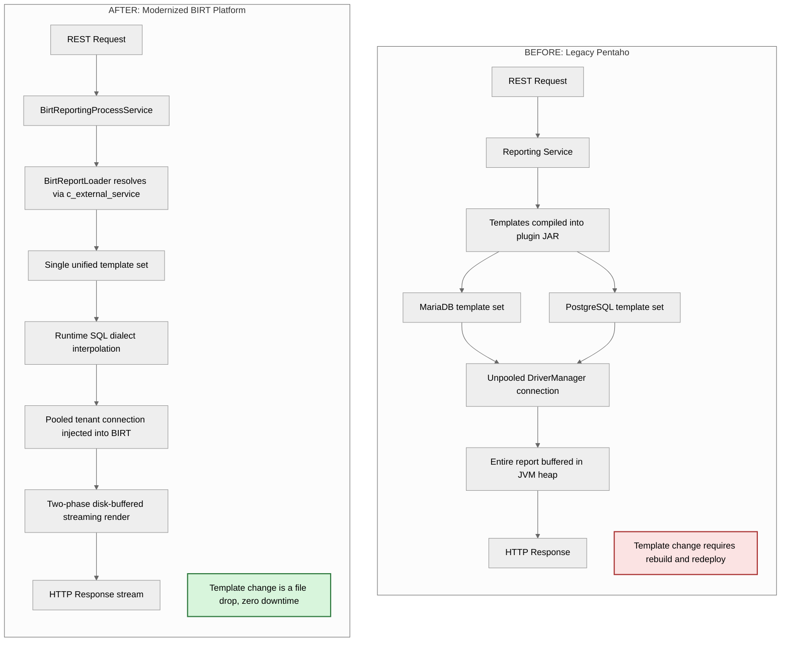
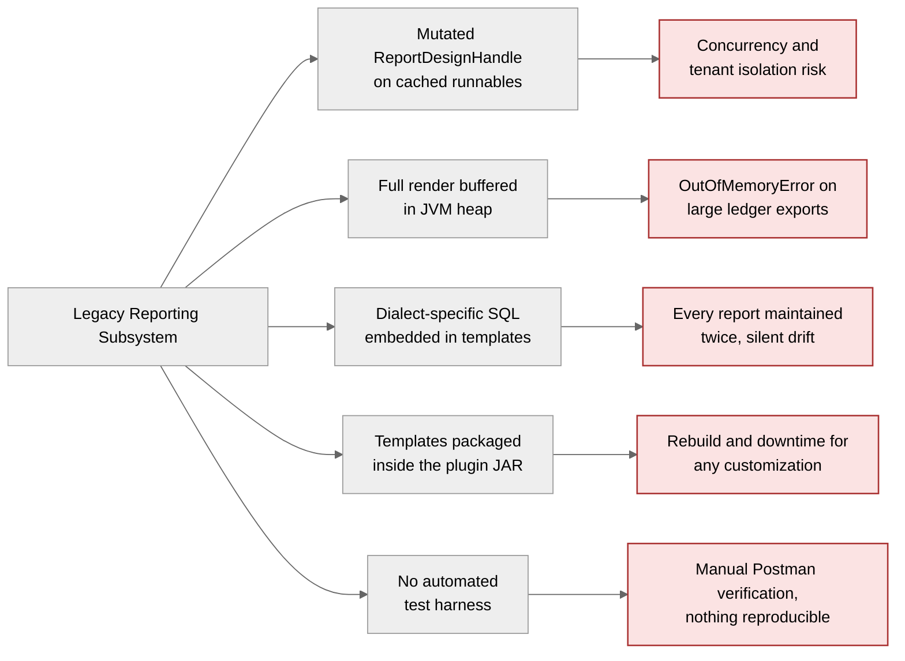
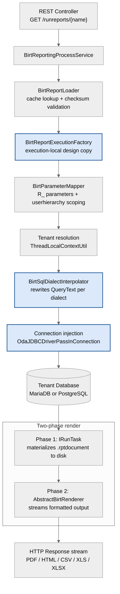
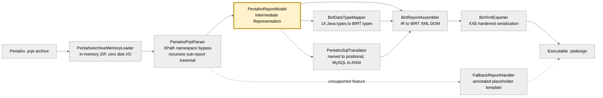
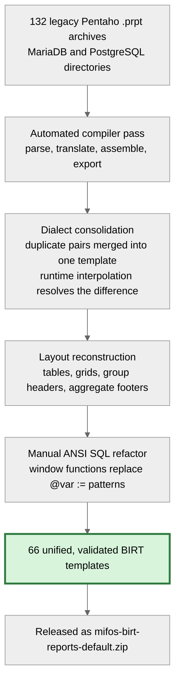
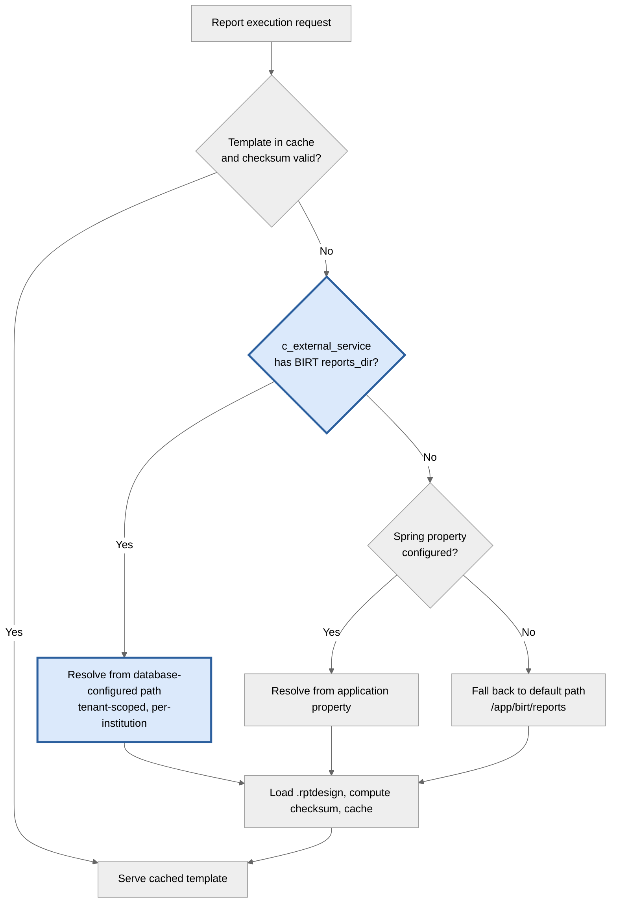
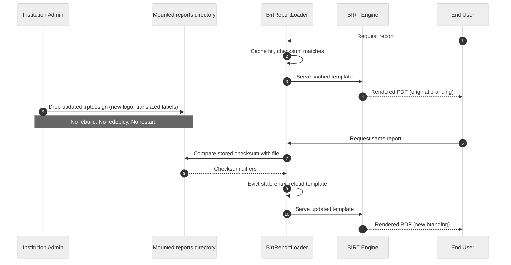
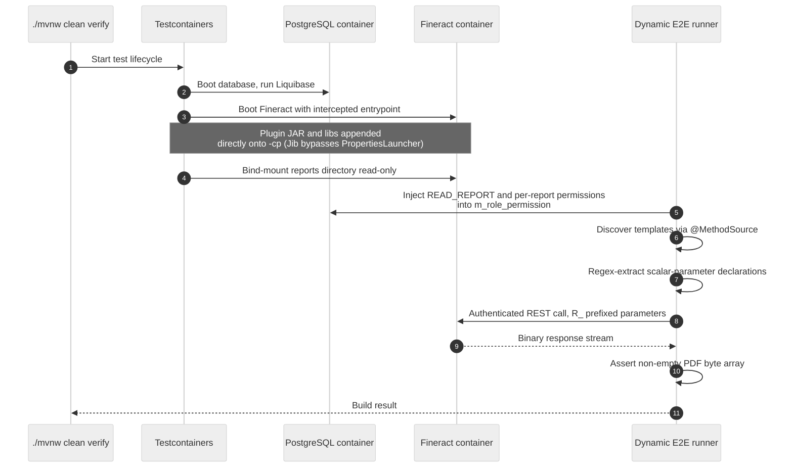
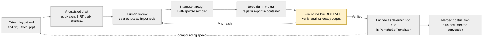
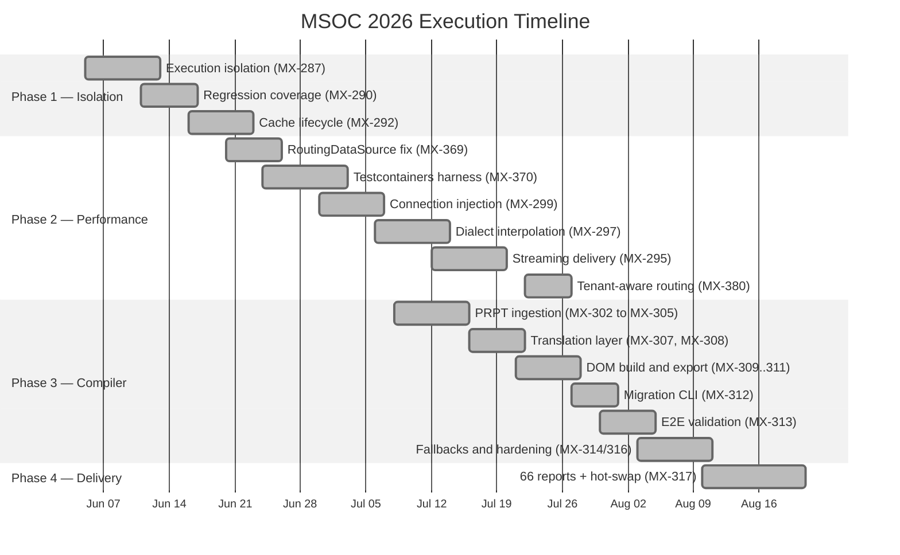

<h1 align="center">Modernizing the Mifos Reporting Engine</h1>

<b>From Legacy Pentaho to a Production-Grade Eclipse BIRT Platform</b>

  
  
  
  
  
  

  
  
  
  
  
  
  
  
  

---

| | |
|---|---|
| **Contributor** | Raghav Agrawal |
| **Organization** | The Mifos Initiative / Apache Fineract |
| **Project** | Enterprise Integration of Eclipse BIRT and Automated Pentaho Migration |
| **Repository** | [`openMF/mifos-reporting-plugin`](https://github.com/openMF/mifos-reporting-plugin) |
| **Mentor** | Francisco Cuandon |
| **Jira Epics** | MX-284 · MX-291 · MX-301 · MX-316 / MX-317 |
| **Status** | 20 pull requests merged across four phases |

---

## Table of Contents

- [1. Abstract](#1-abstract)
- [2. The Original Problem](#2-the-original-problem)
- [3. Core Deliverables](#3-core-deliverables)
  - [3.1 Phase 1: Execution Isolation and Thread Safety](#31-phase-1-execution-isolation-and-thread-safety)
  - [3.2 Phase 2: Datasource Integration, Streaming and Dialect Abstraction](#32-phase-2-datasource-integration-streaming-and-dialect-abstraction)
  - [3.3 Phase 3: The Migration Compiler and 66 Validated Reports](#33-phase-3-the-migration-compiler-and-66-validated-reports)
  - [3.4 Phase 4: Zero-Downtime Hot-Swapping via c_external_service](#34-phase-4-zero-downtime-hot-swapping-via-c_external_service)
  - [3.5 CI/CD Stabilization and Automated Verification](#35-cicd-stabilization-and-automated-verification)
- [4. An AI-Augmented Contributor Workflow](#4-an-ai-augmented-contributor-workflow)
- [5. Challenges and Roadblocks](#5-challenges-and-roadblocks)
- [6. Pull Requests, Tickets and Code](#6-pull-requests-tickets-and-code)
- [7. Community, Mentorship and Collaboration](#7-community-mentorship-and-collaboration)
- [8. Current State and Future Scope](#8-current-state-and-future-scope)
- [9. Acknowledgements](#9-acknowledgements)

---

## 1. Abstract

Reporting is how a loan officer sees an arrears list and how a regulator receives a balance sheet. For over a decade, Fineract ran that on Pentaho: ASF license incompatibilities, fragile off-Maven-Central dependencies, and every report authored twice, once for MariaDB and once for PostgreSQL.

I rebuilt the subsystem in four phases:

- **Phase 1** made the execution pipeline thread-safe and cache-correct.
- **Phase 2** integrated the engine with Fineract's datasource layer, replaced in-memory buffering with disk-buffered streaming, and added runtime SQL dialect interpolation that ended template duplication.
- **Phase 3** delivered a compiler that translates Pentaho `.prpt` archives into BIRT `.rptdesign` templates, migrating **132 legacy reports into 66 unified, dialect-agnostic templates**.
- **Phase 4** externalized those templates so report assets are hot-swappable at runtime with zero downtime.

A fifth thread ran through all four: the plugin's first automated test infrastructure, a Testcontainers pipeline that boots a real Fineract instance and asserts real PDF bytes on every build.

<i>Figure 1: Legacy Pentaho architecture versus the modernized BIRT reporting platform.</i>

---

## 2. The Original Problem

This was not a bug list. It was five structural constraints.

**Not concurrency-safe.** The plugin cached `IReportRunnable` instances, then mutated the underlying `ReportDesignHandle` before each render. BIRT 4.23's `createRunAndRenderTask()` does not clone the design model, so concurrent executions shared mutable state, and any caching improvement would have escalated that into a real tenant isolation risk.

**Memory scaled with report size.** Rendering buffered the entire output before writing the response. A large ledger export was an `OutOfMemoryError` waiting for a busy Monday.

**Every report existed twice.** Templates embedded dialect-specific SQL, so MariaDB and PostgreSQL had parallel directories. Two files, two reviews, two chances for a financial calculation to diverge.

**Templates lived inside the JAR.** Changing a column header or localizing a report meant rebuilding the plugin and taking a maintenance window. Customization was impossible without downtime.

**No automated tests.** Verification meant configuring `-Dloader.path` by hand, seeding a schema, booting a server, copying the JAR in, and firing Postman requests. Nothing reproducible, nothing in CI.

<i>Figure 2: The five structural constraints and their operational consequences.</i>

---

## 3. Core Deliverables

### 3.1 Phase 1: Execution Isolation and Thread Safety

Before migrating a single report, I made the engine safe to migrate *onto*.

**`BirtReportExecutionFactory`** (MX-287) creates an execution-local `IReportRunnable` from a copied `ReportDesignHandle` on every request. The cached template is read-only by construction, and datasource configuration is applied to the copy, never the cache. I also added explicit `IRunAndRenderTask.close()` cleanup and made datasource configuration failures fail fast instead of logging silently.

The intent matters more than the code: isolation is guaranteed *independently* of the caching layer, so future cache work inherits safety rather than re-establishing it.

MX-290 added regression coverage on the boundaries most likely to break later: renderer defaulting, blank parameters, task closure on failure, and datasource error propagation.

MX-292 fixed cache behaviour. `@Cacheable(sync = true)` collapses duplicate concurrent loads into one, `@CacheEvict` handles invalidation, and checksum-based freshness validation reloads a template whenever the file on disk changes. I added hit/miss/eviction logging for observability.

One finding worth recording: BIRT caching already delegates to Fineract's `RuntimeDelegatingCacheManager`, so cache *implementation* is a platform configuration concern (`NO_CACHE` versus `SINGLE_NODE`), not something the plugin should own. That is why I dropped the private Caffeine cache my proposal had suggested — the right call was to work with the platform, not around it.

### 3.2 Phase 2: Datasource Integration, Streaming and Dialect Abstraction

**RoutingDataSource compatibility (MX-369).** Upstream Fineract introduced a proxy datasource, and the plugin's direct driver inspection broke with `Could not determine driver class name from DataSource`. I added reflective, recursive unwrapping via `determineTargetDataSource()`, keeping direct Hikari handling and avoiding any compile-time dependency on Fineract internals. The plugin now works across old and new Fineract releases.

**Connection injection (MX-299).** The legacy configurer hardcoded decrypted passwords and JDBC URLs into the `.rptdesign` at runtime, so BIRT opened unpooled `DriverManager` connections and bypassed HikariCP entirely. I wrapped execution in a read-only `TransactionTemplate`, fetched the routed connection via `DataSourceUtils.getConnection()`, and passed it to the engine through BIRT's `OdaJDBCDriverPassInConnection` with `CloseAfterUse = false` so Spring returns it to the pool. Reports gained pooling and replica routing; `BirtDataSourceConfigurer` was retired.

**Tenant-aware resolution (MX-380).** Fineract's multi-tenancy is thread-local, and internal BIRT threads could fall back to the default database. I resolved the active tenant via `ThreadLocalContextUtil` and populated the `AppContext` with its exact JDBC coordinates, removing a path that passed an uninitialized datasource downstream.

**Streaming instead of buffering (MX-295).** I split rendering into two phases: `IRunTask` executes SQL and materializes results to a temporary `.rptdocument`, then a renderer streams formatted output straight to the HTTP response. Memory stays flat regardless of report size. Renderers now sit behind an `AbstractBirtRenderer` hierarchy covering PDF, HTML, CSV, XLS and XLSX, so adding a format never touches core execution.

**One template, both dialects (MX-297).** `BirtSqlDialectInterpolator` hooks in after template load, detects the datasource dialect, and rewrites each `OdaDataSetHandle`'s `QueryText` before execution — stripping MySQL backticks, converting `ifnull()` to `coalesce()`. This is the change that ended duplication permanently. With credentials no longer flowing through parameters, I also removed `DatabasePasswordEncryptor` from `BirtParameterMapper`, scoping it strictly to row-level authorization context.

<i>Figure 3: The modernized request lifecycle, from controller to streamed response.</i>

### 3.3 Phase 3: The Migration Compiler and 66 Validated Reports

Manual migration of 132 reports was never viable, so I built a compiler.

<i>Figure 4: The model-to-model migration compiler. The IR is the boundary that insulates generation from legacy Pentaho eccentricities.</i>

**Ingestion (MX-302 to MX-305).** Archives are read entirely in memory to avoid disk I/O during mass migration. XPath bypasses Pentaho's verbose namespaces, and `<sub-report>` nodes are crawled recursively with circular-reference detection and size limits, so one malformed file cannot hang the batch.

**Translation.** `BirtDataTypeMapper` (MX-307) maps Pentaho's fully-qualified Java types to BIRT's lowercase declarations, defaulting safely to `string`. `PentahoSqlTranslator` (MX-308) converts `${named}` interpolation into positional `?` markers while preserving order, including repeated parameters that must become two markers bound to the same value. Both shipped at 100% JaCoCo coverage.

**Generation (MX-309 to MX-311).** `BirtDomBuilder` blocks XXE via `FEATURE_SECURE_PROCESSING`, `BirtReportAssembler` injects SQL into CDATA blocks and binds parameters with an atomic element-ID counter to prevent collisions, and `BirtXmlExporter` serializes with external DTDs disabled.

**Orchestration and hardening.** `MigrationCli` (MX-312) runs the batch via `exec:java` without booting Spring. MX-314 and MX-316 added an SQL pre-processor (`IFNULL()`, `IF()`, `DATE_ADD`, backtick quoting), automatic `<body>` table injection to fix blank PDFs, parameter type coercion, case-insensitive de-duplication of legacy parameter declarations that crashed BIRT with `NameException: DUPLICATE`, and a `FallbackReportHandler` that emits placeholders instead of aborting. The full catalog now processes in ~33 seconds with **zero hard CLI crashes**.

Automation got me most of the way; judgement covered the rest. Reports with deeply nested MySQL user-defined variables produced plausible-looking generated SQL that returned wrong numbers, so I quarantined and hand-refactored them: `@var :=` accumulators became window functions, schema drift was patched (`m_savings_account_transaction.created_by`, `m_loan.total_repayment_derived`), and blank-date parameters were hardened with `CAST(NULLIF(..., '') AS DATE)`. Bodies, groups, headers and aggregate footers were rebuilt as native BIRT tables and grids so output is visually faithful, not merely functional.

<i>Figure 5: Migration funnel. Dialect consolidation is where 132 legacy files collapse into one source of truth.</i>

### 3.4 Phase 4: Zero-Downtime Hot-Swapping via c_external_service

This is the deliverable I am most proud of, because it changes what institutions are *allowed* to do.

Committing 66 `.rptdesign` files into the plugin source would force a rebuild for every branding or localization change. Instead I externalized them (MX-317). `BirtReportLoader` resolves the template directory through a three-tier priority chain.

<i>Figure 6a: Template resolution priority chain, database configuration first.</i>

A Liquibase changeset (`002-birt-external-service.xml`) registers `BIRT` in `c_external_service` and sets `reports_dir` to `/app/birt/reports`; the loader queries both via `JdbcTemplate`. Combined with checksum invalidation from Phase 1, an administrator drops an updated `.rptdesign` into the mounted directory and the engine picks it up on the next execution: **no rebuild, no redeploy, no downtime**.

<i>Figure 6b: The zero-downtime hot-swap sequence, driven by checksum-based invalidation.</i>

Because resolution is database-driven and tenant-scoped, different tenants can point at different directories, making per-institution branding and localization a configuration concern rather than a fork. The 66 templates ship as `mifos-birt-reports-default.zip` with a per-report REST invocation guide, so any deployment can adopt them without touching code.

### 3.5 CI/CD Stabilization and Automated Verification

The plugin had no automated verification. I built it from zero.

MX-370 spins up a real `apache/fineract` container plus PostgreSQL via Testcontainers, with no hardcoded paths or local setup. MX-313 added the dynamic runner: it mounts the reports directory read-only, discovers every template via JUnit 5 `@MethodSource`, extracts each template's `<scalar-parameter>` declarations, builds a compliant REST request (prefixing user parameters with Fineract's `R_` protocol while leaving system parameters bare), and asserts a non-empty PDF stream.

<i>Figure 7: The containerized end-to-end verification pipeline.</i>

Two fixes made CI trustworthy rather than merely green. First, a **parameterless, database-independent `Integration_Test_Report.rptdesign`**: the suite had been validating domain reports against an unseeded database, so failures reflected missing fixtures rather than regressions. A dependency-free template verifies the engine lifecycle deterministically. Second, **automated permission injection**: the runner grants `READ_REPORT` and per-report permissions into `m_role_permission` before execution, eliminating `403` failures originating in Fineract's security layer rather than in reporting code.

---

## 4. An AI-Augmented Contributor Workflow

Much of this project was archaeology: thousands of lines of undocumented Pentaho XML and decade-old MySQL. With my mentor's guidance on using AI responsibly, I built a workflow that treated it as a **comprehension and drafting accelerator**, never as an unverified source of truth.

**Layout translation.** For each report I extracted its `layout.xml` and used Gemini to draft the equivalent BIRT `<body>` structure — tables, grids, group headers, aggregate footers. Pentaho and BIRT express layout with entirely different vocabularies, and hand-transcribing 66 reports would have consumed the term. Every draft went through the assembler, rendered to a real PDF, and was compared against legacy output before acceptance.

**SQL translation.** This started rough. Early conversions were slow as I learned which MySQL constructs translated cleanly and which produced plausible SQL with wrong numbers. After about five reports the pattern stabilized, throughput improved sharply, and those hard-won rules became the deterministic dialect rules in `PentahoSqlTranslator`.

**Validation gate.** Nothing was accepted on inspection. I seeded the database with dummy data, registered the report in the running container, and executed it through the live REST API via Postman. Once that loop proved a report correct, I automated it — which is exactly how the Testcontainers pipeline came to exist.

<i>Figure 8: Every generated artifact passes an empirical validation gate before becoming an encoded rule.</i>

The durable output is not the generated code; it is the **method**. The migration guide, API reference and fallback conventions give the next contributor a repeatable approach instead of requiring them to rediscover one.

---

## 5. Challenges and Roadblocks

**Testing was the biggest bottleneck.** For weeks, verifying anything meant manually spinning up a Fineract container, copying the freshly built JAR in by hand, restarting, seeding data, and firing Postman requests one at a time. Every iteration cost minutes before a single assertion, and nothing was reproducible for anyone else. That pain is why I built the Testcontainers harness: the container now spins up automatically, mounts the plugin and reports, and runs the full suite on `./mvnw clean verify`. Adding a test is now writing a test, not rebuilding an environment.

**Jib classpath hijacking.** The official `apache/fineract` image is built with Jib, which bypasses Spring Boot's `PropertiesLauncher`, so `-Dloader.path` silently did nothing and the plugin vanished with a `ClassNotFoundException`. I intercepted the container entrypoint and appended the plugin JAR and its libs directly onto `-cp`, ordering Fineract's core classpath first to prevent version downgrades.

**JAR hell and Liquibase strict parsing.** Transitive BIRT dependencies pulled in stale `ehcache` binaries (`NoSuchMethodError`) and duplicate Fineract changelogs, which Liquibase rejected with `ChangeLogParseException` before a single test could run. Fixed by dependency shifting during `package` with explicit `<excludeGroupIds>` pruning of `ehcache`, `fineract`, `spring` and `liquibase`.

**Testcontainers and self-signed TLS.** Fineract terminates TLS with a self-signed certificate on a dynamic port, which RestAssured rejected everywhere. Resolved with relaxed HTTPS validation scoped strictly to the test context, plus dynamic host and port binding for portability.

**A CGLIB proxy that broke plugin discovery.** Adding `@Transactional(readOnly = true)` made Spring wrap the service in a proxy that stripped the `@ReportService` annotation, NPE-ing `ReportingProcessServiceProvider` at boot. A programmatic `TransactionTemplate` gave the same guarantee with no proxy.

**A silent bean-naming failure.** Fineract resolves services by the convention `[reportType]ReportingProcessService`. Spring's default naming produced `birtReportingProcessServiceImpl`, so lookup failed with `503 err.msg.report.service.implementation.missing` — an error pointing nowhere near the cause. One explicit `@Service("birtReportingProcessService")` fixed it, after a long day in Fineract's provider internals.

**Knowing when not to automate.** The most valuable lesson. Regex-translating nested MySQL variable logic produced SQL that compiled and returned subtly wrong financial numbers. In core banking that is worse than a crash. Manual rewriting was slower and unambiguously correct.

---

## 6. Pull Requests, Tickets and Code

> **Placeholder: add live Jira and GitHub links before submission.**

| Phase | Focus | Jira Ticket | Pull Request |
|---|---|---|---|
| 1 | Execution isolation | `MX-287` | `#483` |
| 1 | Regression coverage | `MX-290` | `#486` |
| 1 | Cache lifecycle and invalidation | `MX-292` | `#490` |
| 2 | RoutingDataSource compatibility | `MX-369` | `#493` |
| 2 | Testcontainers framework | `MX-370` | `#499` |
| 2 | Connection injection | `MX-299` | `#503` |
| 2 | SQL dialect interpolation and E2E | `MX-297` | `#508` |
| 2 | Streaming report delivery | `MX-295` | `#510` |
| 2 | Tenant-aware routing | `MX-380` | `#516` |
| 3 | PRPT ingestion and XPath parser | `MX-302`–`MX-305` | `#509` |
| 3 | Data type normalization | `MX-307` | `#517` |
| 3 | SQL parameter translator | `MX-308` | `#518` |
| 3 | BIRT XML DOM builder | `MX-309` | `#520` |
| 3 | Dataset and parameter assembly | `MX-310` | `#521` |
| 3 | XML transformer and exporter | `MX-311` | `#522` |
| 3 | Migration CLI orchestrator | `MX-312` | `#525` |
| 3 | Dynamic E2E validation pipeline | `MX-313` | `#527` |
| 3 | Fallback handlers and dialect rules | `MX-314` | `#529` |
| 3 | Migration engine hardening | `MX-316` | `#532` |
| 4 | 66 reports and `c_external_service` | `MX-317` | `#535` |

**Release artifacts:** `mifos-birt-reports-default.zip` (66 validated templates) and `mifos-birt-reports-api-reference.md` (per-report REST invocation guide).

<i>Figure 9: Phase timeline mapped to merged pull requests.</i>

---

## 7. Community, Mentorship and Collaboration

This project was shaped by review, not written in isolation.

**Francisco Cuandon** mentored the work end to end and reviewed every pull request. He pushed consistently on **SOLID principles** — the renderer hierarchy, the single-responsibility decomposition of the execution pipeline, and the extensible design of the migration compiler all trace back to his review comments rather than my first drafts. He also guided **how I used AI**, insisting on a validate-before-accept workflow rather than trusting generated output, which is what made the translation workflow trustworthy at scale. His steady architectural feedback kept twenty PRs coherent as one system.

**Victor Romero** shaped two critical pieces: the Testcontainers direction that became the plugin's verification story, and the final delivery of the 66 reports — including externalizing assets through `c_external_service` rather than committing them, and deferring asset delivery to a separate ticket so the migration engine PR stayed reviewable. That turned a 15,000-line diff into something a human could actually read.

I worked in **atomic, independently reviewable pull requests**: twenty across the term, each mapped to a Jira ticket, each mergeable on its own. Collaboration ran asynchronously through Mifos Slack (`#mifos-reporting-module`, `#gsoc`), with review in GitHub PR threads and tracking in Jira. CodeRabbit ran on nearly every PR and caught real issues — magic strings, null-safety gaps, unhandled edge cases — which I treated as a genuine first-pass reviewer.

---

## 8. Current State and Future Scope

**Current state:** the BIRT engine is thread-safe, streaming, tenant-aware and dialect-agnostic, covered by an automated containerized test suite, with all 66 migrated reports validated and resolved dynamically from an externalized, hot-swappable directory. Twenty pull requests are merged.

**Future scope for the community:**

- **An API-lifecycle-based validation framework.** The highest-value next step. Validating a domain report still requires a human to understand its data dependencies and seed them by hand. This framework would introspect each `.rptdesign` to derive its dependency graph — required parameters, referenced entities, and the office, client, loan and savings records the query needs — then drive Fineract's own REST API to **create that state programmatically** before executing and asserting. Report validation becomes a self-provisioning regression suite rather than a manual seeding exercise.
- **Web app and Mifos X UI integration**, surfacing the new output formats and parameter metadata to end users.
- **Asynchronous and batch execution** via HTTP 202 and `jobId` polling, which the decoupled execution service was architected to accept without a rewrite. Unlocks end-of-day batch generation across hundreds of branches.
- **New visualization modules.** BIRT's charting engine is untapped; portfolio-at-risk trends and aging analyses are natural first candidates.
- **Role-based report access and row-level scoping** through deeper `PlatformSecurityContext` integration.
- **Dynamic font and asset management** for pixel-accurate PDF rendering and full Unicode coverage in containers.

---

## 9. Acknowledgements

My sincere thanks to **Francisco Cuandon**, whose review on every pull request and insistence on doing things properly rather than quickly made this a better system, and to **Victor Romero** for the testing and delivery guidance that shaped the final phase. Thanks also to the wider Mifos community for reviews, patience, and context on a codebase with a long memory.

Contributing to infrastructure that supports financial inclusion has been the most rewarding engineering work I have done, and I intend to keep contributing to the reporting subsystem well beyond this program.

---

<i>Report prepared for MSOC 2026 final evaluation.</i>

