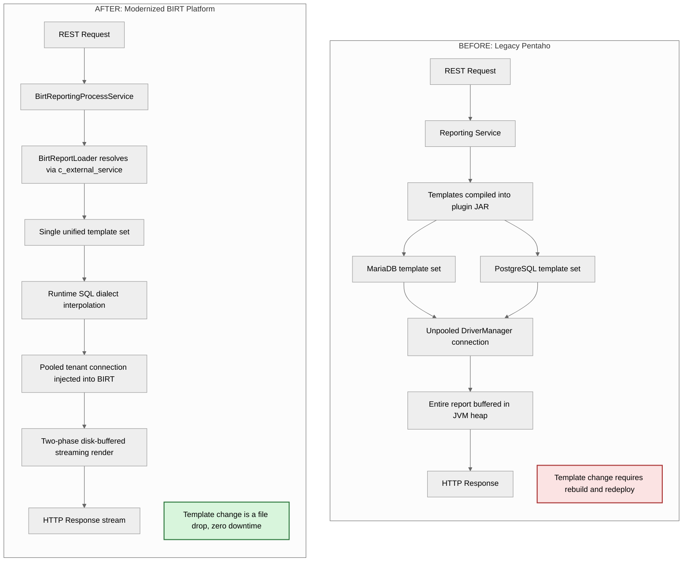
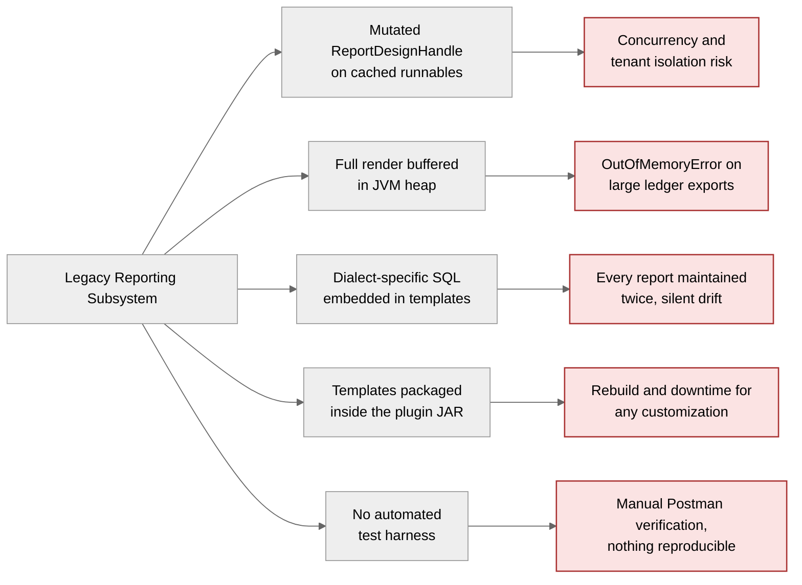
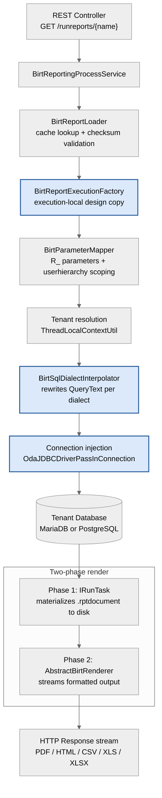
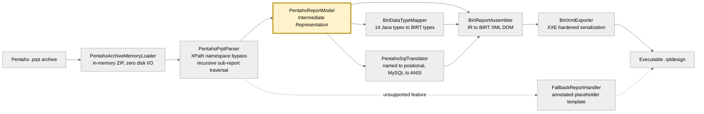
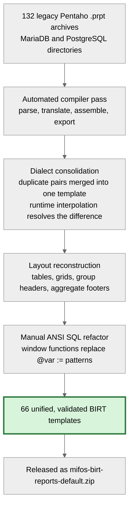
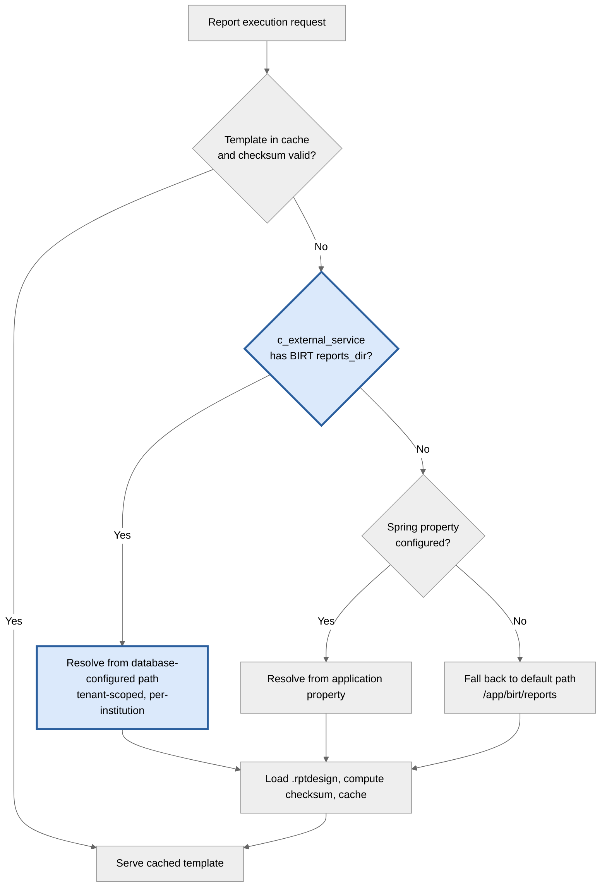
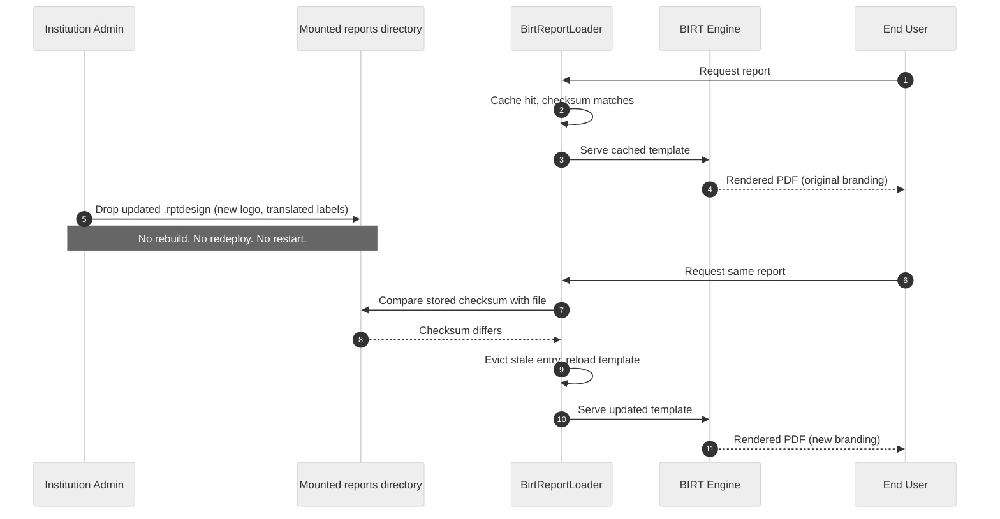
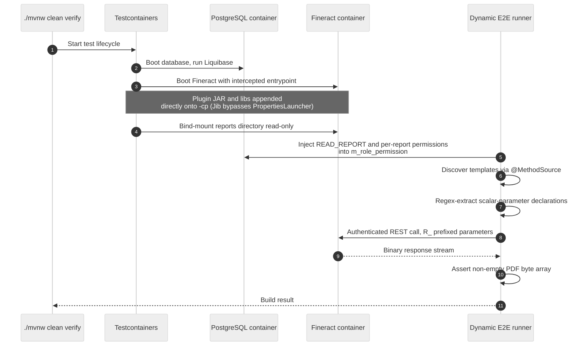
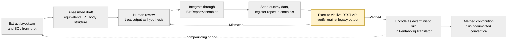
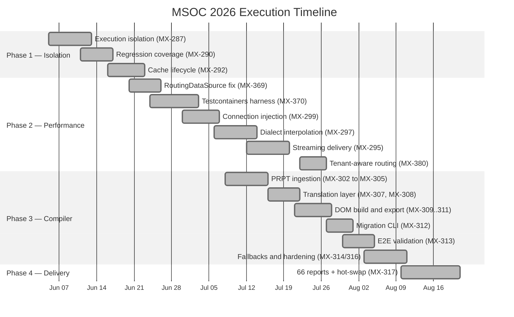

<h1 align="center">Modernizing the Mifos Reporting Engine</h1>

<b>From Legacy Pentaho to a Production-Grade Eclipse BIRT Platform</b>

  
  
  
  
  
  

  
  
  
  
  
  
  
  
  

---

| | |
|---|---|
| **Contributor** | Raghav Agrawal |
| **Organization** | The Mifos Initiative / Apache Fineract |
| **Project** | Enterprise Integration of Eclipse BIRT and Automated Pentaho Migration |
| **Repository** | [`openMF/mifos-reporting-plugin`](https://github.com/openMF/mifos-reporting-plugin) |
| **Mentor** | Francisco Cuandon |
| **Jira Epics** | MX-284 (Modularization and Thread Safety) · MX-291 (Performance and Streaming) · MX-301 (Migration Compiler) · MX-316 / MX-317 (Validation and Externalization) |
| **Status** | 20 pull requests merged across four phases |

---

## Table of Contents

- [1. Abstract](#1-abstract)
- [2. The Original Problem](#2-the-original-problem)
- [3. Core Deliverables](#3-core-deliverables)
  - [3.1 Phase 1: Execution Isolation and Thread Safety](#31-phase-1-execution-isolation-and-thread-safety)
  - [3.2 Phase 2: Datasource Integration, Streaming and Dialect Abstraction](#32-phase-2-datasource-integration-streaming-and-dialect-abstraction)
  - [3.3 Phase 3: The Migration Compiler and 66 Validated Reports](#33-phase-3-the-migration-compiler-and-66-validated-reports)
  - [3.4 Phase 4: Zero-Downtime Hot-Swapping via c_external_service](#34-phase-4-zero-downtime-hot-swapping-via-c_external_service)
  - [3.5 CI/CD Stabilization and Automated Verification](#35-cicd-stabilization-and-automated-verification)
- [4. An AI-Augmented Contributor Workflow](#4-an-ai-augmented-contributor-workflow)
- [5. Challenges and Roadblocks](#5-challenges-and-roadblocks)
- [6. Pull Requests, Tickets and Code](#6-pull-requests-tickets-and-code)
- [7. Community, Mentorship and Collaboration](#7-community-mentorship-and-collaboration)
- [8. Current State and Future Scope](#8-current-state-and-future-scope)
- [9. Acknowledgements](#9-acknowledgements)

---

## 1. Abstract

The reporting subsystem is the operational backbone of every Fineract deployment. It is how a loan officer sees an arrears list, how a branch manager closes a day, and how a regulator receives a balance sheet. For over a decade that subsystem ran on Pentaho: an engine carrying ASF license incompatibilities, fragile off-Maven-Central dependencies, and a maintenance model that required every report to be authored twice, once for MariaDB and once for PostgreSQL.

Over this MSOC term I rebuilt that subsystem end to end, in four deliberate phases.

**Phase 1** made the execution pipeline thread-safe and cache-correct. **Phase 2** integrated the engine natively with Fineract's datasource infrastructure, replaced in-memory buffering with disk-buffered streaming, and introduced runtime SQL dialect interpolation that permanently eliminated template duplication. **Phase 3** delivered a compiler that mechanically translates legacy Pentaho `.prpt` archives into executable BIRT `.rptdesign` templates, migrating **132 legacy Pentaho reports into 66 unified, dialect-agnostic BIRT templates**. **Phase 4** externalized those templates entirely, replacing JAR-coupled packaging with database-driven resolution that makes report assets hot-swappable at runtime with zero server downtime.

Running through all four phases was a fifth thread of work: building the plugin's first automated testing infrastructure, a containerized Testcontainers pipeline that boots a real Fineract instance, mounts real templates, and asserts real PDF bytes on every build.

<i>Figure 1: Legacy Pentaho architecture versus the modernized BIRT reporting platform.</i>

---

## 2. The Original Problem

The state of reporting when I started was not a bug list; it was a set of structural constraints.

**The execution pipeline was not concurrency-safe.** The plugin cached `IReportRunnable` instances and then mutated the underlying `ReportDesignHandle` with tenant-specific datasource properties before each render. In BIRT 4.23, `createRunAndRenderTask()` does not clone the design model, meaning concurrent executions could contend over shared mutable design state, and any future caching improvement would escalate that into a genuine cross-tenant isolation risk.

**Memory consumption scaled with report size.** Rendering buffered the entire output before writing the HTTP response, so a large general ledger export was an `OutOfMemoryError` waiting for a busy Monday.

**Every report existed twice.** Because Pentaho templates embedded raw dialect-specific SQL, the ecosystem maintained parallel directories for MariaDB and PostgreSQL. Two files, two review cycles, two chances for a financial calculation to silently diverge.

**Templates were welded to the deployment artifact.** Report definitions lived inside `src/main/resources`, compiled into the plugin JAR. An institution wanting to change a column header, add a logo, or localize a report had to rebuild the plugin and take a maintenance window. Customization, the most requested capability from real deployments, was structurally impossible without downtime.

**There was no automated test infrastructure at all.** Verifying a change meant manually configuring `-Dloader.path`, hand-seeding a PostgreSQL schema, booting a server, copying the JAR in, and firing Postman requests. Nothing about that is reproducible, and nothing about it runs in CI.

<i>Figure 2: The five structural constraints of the legacy pipeline and their operational consequences.</i>

---

## 3. Core Deliverables

### 3.1 Phase 1: Execution Isolation and Thread Safety

Before migrating a single report, I made the engine safe to migrate *onto*. This phase is unglamorous and load-bearing: everything later in the project depends on it.

I introduced **`BirtReportExecutionFactory`** (MX-287), which creates an execution-local `IReportRunnable` from a copied `ReportDesignHandle` on every request. The cached template is now read-only by construction, each render owns an isolated design, and datasource configuration is applied to the copy, never the cache. In the same change I added explicit `IRunAndRenderTask.close()` cleanup to stop resource leaks, and converted datasource configuration failures from silent logging to fail-fast errors, so a misconfiguration surfaces immediately instead of producing a mysteriously empty report.

The architectural intent matters more than the code: the design deliberately guarantees isolation *independently* of the caching layer, so any future cache optimization inherits safety rather than having to re-establish it.

I then hardened the pipeline against regression (MX-290) with coverage for default renderer selection, blank-parameter handling, task closure on render failure, and datasource error propagation, the collaborator boundaries most likely to break under future refactoring.

Finally I addressed cache behaviour and lifecycle (MX-292). Concurrent requests for the same uncached template previously triggered duplicate loads and compilations; `@Cacheable(sync = true)` collapses that into a single load with the rest waiting. I added `@CacheEvict` invalidation, checksum-based freshness validation so an updated on-disk template is automatically evicted and reloaded, and cache hit/miss/eviction logging for runtime observability.

Investigation also surfaced something worth documenting for the community: BIRT caching already delegates to Fineract's platform-wide `RuntimeDelegatingCacheManager`, so the cache *implementation* is a platform configuration concern (`NO_CACHE` versus `SINGLE_NODE`) rather than something the plugin should own. That finding is why I did not bolt a private Caffeine cache onto the plugin as my proposal originally suggested. The correct engineering decision was to work with the platform, not around it.

### 3.2 Phase 2: Datasource Integration, Streaming and Dialect Abstraction

With execution isolated, Phase 2 connected the engine properly to Fineract and removed the two remaining scalability ceilings.

**Compatibility with Fineract's evolving datasource layer (MX-369).** Upstream Fineract introduced `RoutingDataSource`, a proxy delegating to tenant-specific datasources. The plugin resolved its JDBC driver by inspecting the injected `DataSource` directly, so report generation began failing outright with `Could not determine driver class name from DataSource`. I added reflective, recursive datasource unwrapping through `determineTargetDataSource()`, retaining direct Hikari handling and avoiding any compile-time dependency on Fineract internals, so the plugin now works across both older and newer Fineract releases.

**Native participation in Spring-managed connections (MX-299).** The legacy configurer extracted decrypted passwords and raw JDBC URLs and hardcoded them into the `.rptdesign` at runtime, which meant BIRT opened its own unpooled `DriverManager` connections, bypassing HikariCP entirely and making read-replica routing impossible. I implemented a **Connection Injection Pattern**: the execution lifecycle is wrapped in a read-only `TransactionTemplate`, the routed connection is fetched via `DataSourceUtils.getConnection()`, and passed into the engine through BIRT's ODA `AppContext` using `OdaJDBCDriverPassInConnection`, with `CloseAfterUse = false` so Spring's transaction manager returns the connection to the pool cleanly. Reports gained replica routing and connection pooling, and the legacy `BirtDataSourceConfigurer` was retired.

**Tenant-aware resolution (MX-380).** Fineract's multi-tenancy is thread-local, and internal BIRT engine threads could fall back to the default database. I implemented explicit tenant resolution via `ThreadLocalContextUtil`, populating the BIRT `AppContext` with the active tenant's exact JDBC coordinates, and removed a flawed execution path that passed an uninitialized datasource into `DataSourceUtils.getConnection()`.

**Streaming instead of buffering (MX-295).** I replaced the monolithic `IRunAndRenderTask` with a **two-phase, disk-buffered pipeline**: Phase 1 (`IRunTask`) executes the SQL and materializes results to a temporary `.rptdocument`; Phase 2 reads from disk and streams formatted output directly to the HTTP response. Memory stays flat regardless of report size. Rendering moved behind an `AbstractBirtRenderer` hierarchy, with `PdfBirtRenderer`, `CsvBirtRenderer` and siblings covering PDF, HTML, CSV, XLS and XLSX, so adding a format no longer requires touching core execution logic. The same change modernized legacy internals: `DateTimeFormatter` over `SimpleDateFormat`, `java.nio.file.Files` for file management, and functional-interface cleanup helpers to eliminate duplicated `try-catch` blocks.

**One template, both dialects (MX-297).** This is the change that permanently ended duplication. `BirtSqlDialectInterpolator` hooks in immediately after template load, iterates BIRT's `OdaDataSetHandle` instances, auto-detects the underlying datasource dialect, and rewrites `QueryText` before execution, stripping MySQL backticks and converting `ifnull()` to `coalesce()` for PostgreSQL targets. The same PR closed a security gap: with credentials no longer flowing through report parameters, I removed the `DatabasePasswordEncryptor` dependency from `BirtParameterMapper`, scoping the parameter layer strictly to row-level authorization context (`userhierarchy`, `userid`).

<i>Figure 3: The modernized request lifecycle, from controller to streamed response.</i>

### 3.3 Phase 3: The Migration Compiler and 66 Validated Reports

Manual migration of 132 reports was never viable. So I built a compiler.

The pipeline is strictly unidirectional: a `.prpt` archive is unzipped in memory, parsed via XPath into an engine-agnostic Intermediate Representation, translated, assembled into a secured BIRT XML DOM, and serialized to a `.rptdesign` file.

<i>Figure 4: The model-to-model migration compiler. The Intermediate Representation is the decoupling boundary that insulates generation from legacy Pentaho eccentricities.</i>

The ingestion layer (MX-302 through MX-305) reads archives entirely in memory to avoid disk I/O during mass migration, bypasses Pentaho's verbose XML namespaces with XPath, and recursively crawls `<sub-report>` nodes, with circular-reference detection and archive size limits so a malformed legacy file cannot hang or exhaust the batch.

The translation layer handles the genuinely fiddly semantics. `BirtDataTypeMapper` (MX-307) maps fully-qualified Pentaho Java types to BIRT's strict lowercase declarations, defaulting safely to `string` rather than crashing on unknown types. `PentahoSqlTranslator` (MX-308) converts Pentaho's `${named}` interpolation into BIRT's positional `?` markers while preserving exact ordering, including the case where a repeated `${id}` must become two sequential markers both bound to `id`. Both shipped at 100% JaCoCo branch and line coverage.

Generation is built on a secured DOM (MX-309/310/311): `BirtDomBuilder` initializes `DocumentBuilderFactory` with `FEATURE_SECURE_PROCESSING` to block XXE, `BirtReportAssembler` injects translated SQL into CDATA blocks and binds parameters into BIRT's `<list-property>` structures with an atomic element-ID counter to prevent collisions on large reports, and `BirtXmlExporter` serializes with external DTDs and stylesheets explicitly disabled.

`MigrationOrchestrator` and a standalone `MigrationCli` (MX-312) tie it together as a batch job runnable via `exec:java` without booting the Spring context. Hardening followed in MX-314 and MX-316: an AST and regex pre-processor translating `IFNULL()`, `IF()`, `DATE_ADD` and backtick quoting; automatic injection of a structural `<body>` table bound to the primary dataset to fix blank-PDF output; parameter type coercion to stop strict-typing cast failures; case-insensitive de-duplication of legacy parameter declarations (`currencyId` versus `currencyid`) that were crashing BIRT's parser with `NameException: DUPLICATE`; and a `FallbackReportHandler` that emits an annotated placeholder template instead of aborting the batch. The full catalog now processes in roughly 33 seconds with **zero hard CLI crashes**.

Automation got me most of the way; engineering judgement covered the rest. Reports carrying deeply nested MySQL user-defined variables were not something a regex should ever attempt to rewrite, since plausible-looking generated SQL returned subtly wrong financial numbers. On mentor guidance I quarantined those and hand-refactored them to standard ANSI SQL: replacing `@var :=` accumulator patterns with window functions, patching schema drift (`m_savings_account_transaction.created_by`, `m_loan.total_repayment_derived`), and hardening blank-date parameters with `CAST(NULLIF(..., '') AS DATE)` against PostgreSQL type-mismatch failures. Report bodies, groups, headers and aggregate footers were reconstructed as native BIRT tables and grids so output is visually faithful, not merely functional.

<i>Figure 5: Migration funnel. Dialect consolidation is where 132 legacy files collapse into a single dialect-agnostic source of truth.</i>

The result: **66 unified BIRT templates, each semantically and visually validated**, collapsing a duplicated 132-file legacy catalog into a single dialect-agnostic source of truth.

### 3.4 Phase 4: Zero-Downtime Hot-Swapping via c_external_service

This is the deliverable I am most proud of, because it changes what institutions are *allowed* to do.

Rather than committing 66 `.rptdesign` files into the plugin source, which would force a server rebuild for every branding or localization change, I externalized them entirely (MX-317). `BirtReportLoader` now resolves the template directory on cache miss through a three-tier priority chain.

<i>Figure 6a: Template resolution priority chain, database configuration first.</i>

A Liquibase changeset (`002-birt-external-service.xml`) registers `BIRT` in `c_external_service` and configures `reports_dir` (`/app/birt/reports`) in `c_external_service_properties`; the loader queries both via `JdbcTemplate`. Combined with the checksum-based invalidation from Phase 1, an administrator drops an updated `.rptdesign` into the mounted directory and the engine picks it up on the next execution: **no rebuild, no redeploy, no downtime**.

<i>Figure 6b: The zero-downtime hot-swap sequence, driven by checksum-based cache invalidation.</i>

Because resolution is database-driven and tenant-scoped, different tenants can point at different template directories, making per-institution branding and localization a configuration concern rather than a fork. The 66 validated templates ship as a downloadable release artifact (`mifos-birt-reports-default.zip`) alongside a complete per-report REST invocation guide, so any deployment can adopt them without touching the codebase.

### 3.5 CI/CD Stabilization and Automated Verification

The plugin had no automated verification. I built it from zero.

The foundation (MX-370) spins up a real `apache/fineract` container plus PostgreSQL via Testcontainers, with zero hardcoded paths or local environment setup. The dynamic runner (MX-313) mounts the reports directory read-only, discovers every template on disk via JUnit 5 `@MethodSource`, parses each template's `<scalar-parameter>` declarations to extract required parameters on the fly, constructs a compliant REST request (correctly prefixing user parameters with Fineract's `R_` protocol while leaving system parameters bare), and asserts a non-empty binary PDF stream.

<i>Figure 7: The containerized end-to-end verification pipeline.</i>

Two fixes in the final phase made CI trustworthy rather than merely green. First, a **parameterless, database-independent `Integration_Test_Report.rptdesign`**: the suite previously validated domain reports against an unseeded test database, so failures reflected missing transactional fixtures rather than real regressions. A dependency-free template lets CI verify the *engine lifecycle*, meaning boot, load, bind, render, stream, deterministically. Second, **automated permission injection**: the runner programmatically grants `READ_REPORT` and per-report permissions into `m_role_permission` before execution, eliminating spurious `403 Forbidden` failures originating in Fineract's security layer rather than in reporting code.

---

## 4. An AI-Augmented Contributor Workflow

A meaningful share of this project was archaeology: reading thousands of lines of undocumented Pentaho XML and decade-old MySQL written by people long gone from the project. With my mentor's explicit guidance on how to use AI responsibly, I developed a repeatable workflow that treated AI as a **comprehension and drafting accelerator**, never as an unverified source of truth.

**Layout translation.** For each Pentaho report I extracted its `layout.xml` and used Gemini to draft the equivalent BIRT `<body>` structure: tables, grids, group headers, aggregate footers. Pentaho and BIRT express layout with fundamentally different element vocabularies, and hand-transcribing that structure for 66 reports would have consumed the entire term. The generated structure was always a first draft. It went through the assembler, was rendered to an actual PDF, and was compared against the legacy output before it was accepted.

**SQL translation.** This started rough. The first conversions were slow and error-prone as I learned which MySQL constructs translated cleanly, which needed manual rewriting, and which produced plausible-looking SQL with wrong numbers. After roughly five reports the pattern stabilized: I knew which prompts produced reliable output, which query shapes to reject outright, and what to check first. Throughput improved sharply from that point, and those hard-won rules are exactly what became the deterministic dialect rules encoded in `PentahoSqlTranslator`.

**Validation gate.** Nothing was accepted on inspection alone. I seeded the database with representative dummy data, registered the report in the running container, and executed it through the live REST API via Postman, verifying real output. Once that loop proved a report correct, I automated it, which is precisely how the Testcontainers pipeline came to exist.

<i>Figure 8: The AI-augmented comprehension loop. Every generated artifact passes an empirical validation gate before it becomes an encoded rule.</i>

The durable output is not the generated code; it is the **method**. The migration guide, the per-report API reference, and the fallback conventions give the next contributor a repeatable approach to legacy translation work rather than requiring them to rediscover it.

---

## 5. Challenges and Roadblocks

**Testing was the single biggest bottleneck of the project.** For the first weeks, verifying anything meant manually spinning up a Fineract container, copying the freshly built plugin JAR into it by hand, restarting, seeding data, and firing Postman requests one at a time. Every iteration cost minutes of setup before a single assertion, and nothing was reproducible for anyone else. That pain is the direct reason I built the Testcontainers harness. The container now spins up automatically, mounts the plugin and reports, and executes the full suite on `./mvnw clean verify`. Adding a new test case is now a matter of writing the test, not rebuilding an environment.

**Jib classpath hijacking.** The official `apache/fineract` image is built with Google Jib, which bypasses Spring Boot's `PropertiesLauncher`, so `-Dloader.path` silently did nothing and the plugin vanished from the classpath with a fatal `ClassNotFoundException`. I solved it by intercepting the container entrypoint at runtime and appending the plugin JAR and its library directory directly onto the `-cp` string, then ordering Fineract's core classpath ahead of BIRT's to prevent transitive version downgrades.

**JAR hell and Liquibase strict parsing.** Transitive BIRT dependencies dragged in stale `ehcache` binaries (`NoSuchMethodError`) and duplicate Fineract changelogs, which Liquibase's strict parser rejected outright with `ChangeLogParseException`, halting startup before a single test could run. The fix was surgical dependency shifting during the `package` phase, with explicit `<excludeGroupIds>` pruning of the `ehcache`, `fineract`, `spring` and `liquibase` namespaces so the test runtime contains BIRT libraries and nothing else.

**Testcontainers and self-signed TLS.** Fineract terminates TLS with a self-signed certificate on a dynamically mapped port, which RestAssured rejected on every developer machine and CI node. Resolved with relaxed HTTPS validation scoped strictly to the test context, plus dynamic host and port binding so the suite is portable across architectures.

**A CGLIB proxy that broke plugin discovery.** Adding `@Transactional(readOnly = true)` for replica routing caused Spring to wrap the service in a dynamic proxy, which stripped the `@ReportService` annotation and produced a `NullPointerException` in `ReportingProcessServiceProvider` during boot. I switched to a programmatic `TransactionTemplate`: same transactional guarantee, no proxy, no annotation loss.

**A silent bean-naming failure.** Fineract resolves reporting services by the convention `[reportType]ReportingProcessService`. Spring's default naming produced `birtReportingProcessServiceImpl`, so lookup failed with `503 err.msg.report.service.implementation.missing`, an error pointing nowhere near the actual cause. One explicit `@Service("birtReportingProcessService")` fixed it, after a long day inside Fineract's provider internals.

**Knowing when not to automate.** The most valuable lesson of the term. Attempting regex translation of nested MySQL variable logic into window functions produced SQL that compiled and returned subtly wrong financial numbers. In a core banking system that is worse than a crash. Quarantining those reports for manual rewrite was slower and unambiguously correct.

---

## 6. Pull Requests, Tickets and Code

> **Placeholder: add live Jira and GitHub links before submission.**

| Phase | Focus | Jira Ticket | Pull Request |
|---|---|---|---|
| 1 | Execution isolation | `MX-287` | `#483` |
| 1 | Regression coverage | `MX-290` | `#486` |
| 1 | Cache lifecycle and invalidation | `MX-292` | `#490` |
| 2 | RoutingDataSource compatibility | `MX-369` | `#493` |
| 2 | Testcontainers framework | `MX-370` | `#499` |
| 2 | Connection injection | `MX-299` | `#503` |
| 2 | SQL dialect interpolation and E2E | `MX-297` | `#508` |
| 2 | Streaming report delivery | `MX-295` | `#510` |
| 2 | Tenant-aware routing | `MX-380` | `#516` |
| 3 | PRPT ingestion and XPath parser | `MX-302`–`MX-305` | `#509` |
| 3 | Data type normalization | `MX-307` | `#517` |
| 3 | SQL parameter translator | `MX-308` | `#518` |
| 3 | BIRT XML DOM builder | `MX-309` | `#520` |
| 3 | Dataset and parameter assembly | `MX-310` | `#521` |
| 3 | XML transformer and exporter | `MX-311` | `#522` |
| 3 | Migration CLI orchestrator | `MX-312` | `#525` |
| 3 | Dynamic E2E validation pipeline | `MX-313` | `#527` |
| 3 | Fallback handlers and dialect rules | `MX-314` | `#529` |
| 3 | Migration engine hardening | `MX-316` | `#532` |
| 4 | 66 reports and `c_external_service` | `MX-317` | `#535` |

**Release artifacts:** `mifos-birt-reports-default.zip` (66 validated templates) and `mifos-birt-reports-api-reference.md` (per-report REST invocation guide, including exact query parameters for reports such as *Active Loans - Details*, *Active Loan Summary per Branch*, and *Balance Sheet*).

<i>Figure 9: Phase timeline across the MSOC term, mapped to merged pull requests.</i>

---

## 7. Community, Mentorship and Collaboration

This project was shaped by review, not written in isolation.

**Francisco Cuandon** mentored the work end to end and reviewed every single pull request. Three areas of his guidance changed the shape of the project. He pushed consistently on **SOLID principles**: the strategy-based renderer hierarchy, the single-responsibility decomposition of the execution pipeline, and the open-for-extension design of the migration compiler all trace back to his review comments rather than my first drafts. He guided **how I used AI** on this project, insisting on a disciplined validate-before-accept workflow rather than trusting generated output, which is what made the layout and SQL translation workflow trustworthy at scale. And he provided the steady architectural feedback that kept twenty PRs coherent as a single system rather than twenty local optimizations.

**Victor Romero** shaped two critical pieces. He guided the Testcontainers direction that became the plugin's automated verification story, and he steered the final delivery of the 66 migrated reports, including the decision to externalize assets through `c_external_service` rather than committing them to source, and to keep the migration engine PR reviewable by deferring asset delivery to a dedicated ticket. That advice turned a 15,000-line diff into something a human could actually review.

Beyond direct mentorship, I worked in **atomic, independently reviewable pull requests**: twenty across the term, each mapped to a Jira ticket, each mergeable on its own. Day-to-day collaboration ran asynchronously through the Mifos Slack channels (`#mifos-reporting-module`, `#gsoc`), with technical review in GitHub PR threads and tracking in Jira. Automated review tooling (CodeRabbit) ran on nearly every PR and caught real issues such as magic strings, null-safety gaps and unhandled edge cases, which I treated as a genuine first-pass reviewer rather than noise.

---

## 8. Current State and Future Scope

**Current state:** the BIRT engine is thread-safe, streaming, tenant-aware and dialect-agnostic, covered by an automated containerized test suite, with all 66 migrated reports validated and resolved dynamically from an externalized, hot-swappable directory. Twenty pull requests are merged across the four phases.

**Future scope for the community:**

- **An API-lifecycle-based validation framework.** This is the highest-value next step. Today, validating a domain report still requires a human to understand its data dependencies and seed them by hand. The framework I would build next introspects each `.rptdesign` to derive its full dependency graph, meaning required parameters, referenced entities, and the office, client, loan and savings records that must exist for the query to return meaningful rows, then drives Fineract's own REST API to **create that state programmatically** before executing the report and asserting output. That turns report validation from a manual seeding exercise into a fully automatic, self-provisioning regression suite, and it is what would let the community add or modify reports with real confidence.
- **Web app and Mifos X UI integration**, surfacing the new engine's output formats and parameter metadata in the front-end so end users benefit directly from streaming and hot-swap.
- **Asynchronous and batch execution**, using the HTTP 202 plus `jobId` polling pattern that the decoupled execution service was deliberately architected to accept without a rewrite. This unlocks end-of-day batch generation across hundreds of branches.
- **New visualization modules.** BIRT's charting engine is entirely untapped; portfolio-at-risk trends and aging analyses are natural first candidates for graphical reports.
- **Role-based report access and row-level scoping**, through deeper integration with `PlatformSecurityContext` to enforce report-level permissions and hierarchy-scoped data at the dataset layer.
- **Dynamic font and asset management**, with externalized TTF registration for pixel-accurate PDF rendering and full Unicode coverage in containerized deployments.

---

## 9. Acknowledgements

My sincere thanks to **Francisco Cuandon**, whose review on every pull request and insistence on doing things properly rather than quickly made this a genuinely better system, and to **Victor Romero** for the testing and delivery guidance that shaped the final phase. Thanks also to the wider Mifos community for reviews, patience, and context on a codebase with a long memory.

Contributing to infrastructure that supports financial inclusion has been the most rewarding engineering work I have done, and I intend to keep contributing to the reporting subsystem well beyond this program.

---

<i>Report prepared for MSOC 2026 final evaluation.</i>

